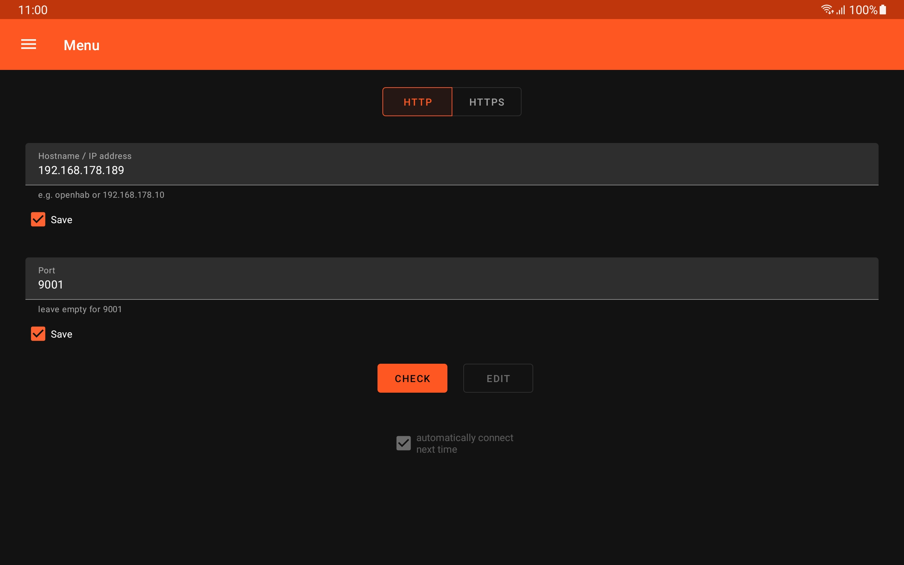
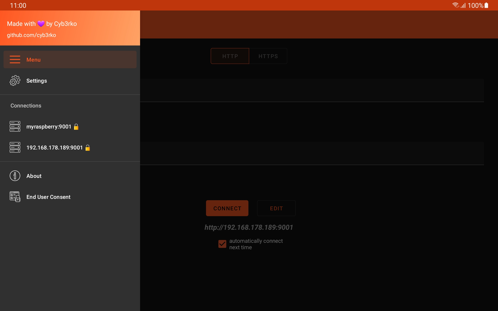
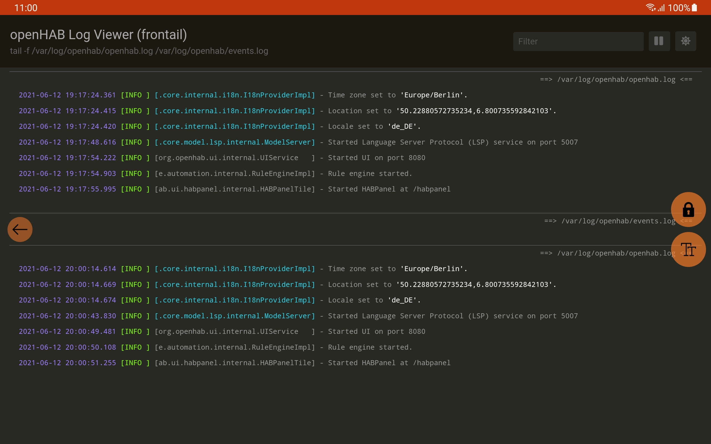
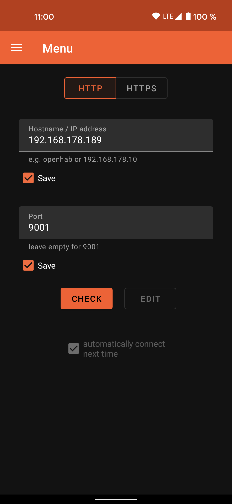
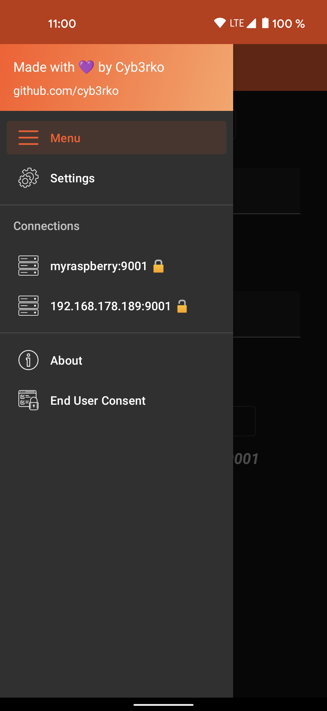
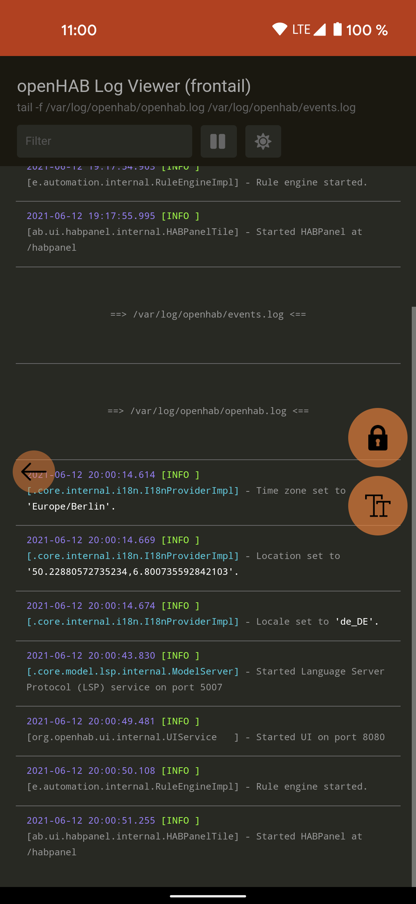

# LogViewer for openHAB-App

- [About this project](#about-this-project)  
    - [Translation](#translation)
- [Features](#features)  
- [Screenshots](#screenshots)  
  - [Smartphone](#smartphone)  
  - [Tablet](#tablet)  
- [Contribute](#contribute)  
- [License](#license)  

---

## About this project
This is a simple and easy to use android app to simplify the mobile access to the log of an [openHAB](https://www.openhab.org/) instance (running [frontail](https://github.com/mthenw/frontail)) on your tablet or your smartphone.

I have not that much experience with programming so please help this project by opening [issues](https://github.com/cyb3rko/logviewer-for-openhab-app/issues) and creating new [pull requests](https://github.com/cyb3rko/logviewer-for-openhab-app/pulls) for improving code and implementing new features (see chapter [Contribute](#contribute)).  
Furthermore I'm still a student so the progress might not be as fast as on other projects.

You can also have a look at my other projects:  
[My GitHub page](https://github.com/cyb3rko)

### Translation

[TRANSLATION PROJECT](https://poeditor.com/join/project?hash=ygnGPjgRfN)

You can now translate this app in many different languages.  
If you can't find a language you're looking for, just drop me a mail at niko@cyb3rko.de and I will add it.

## Features
- accessing the log of an [openHAB](https://www.openhab.org/) instance by entering the hostname / IP address and the port 
- adjusting the text size of the log 
- save recent connections and reconnect automatically
- switchable View Lock function to automatically scroll to the newest log entry and lock touch input 
- nightmode  
- hiding the topbar of the log via settings

## Screenshots
### Tablet
||||
|:---:|:---:|:---:|

### Smartphone
||||
|:---:|:---:|:---:|

## Contribute
Of course I'm happy about any kind of contribution.

For creating [issues](https://github.com/cyb3rko/logviewer-for-openhab-app/issues) there's no real guideline you should follow.
If you create [pull requests](https://github.com/cyb3rko/logviewer-for-openhab-app/pulls) please try to use my syntax that I follow.
Using a unified code format makes it much easier for me and for everyone else.

## License

    Copyright 2021, Cyb3rKo

    Licensed under the Apache License, Version 2.0 (the "License");
    you may not use this file except in compliance with the License.
    You may obtain a copy of the License at
    
        http://www.apache.org/licenses/LICENSE-2.0

    Unless required by applicable law or agreed to in writing, software
    distributed under the License is distributed on an "AS IS" BASIS,
    WITHOUT WARRANTIES OR CONDITIONS OF ANY KIND, either express or implied.
    See the License for the specific language governing permissions and
    limitations under the License.
